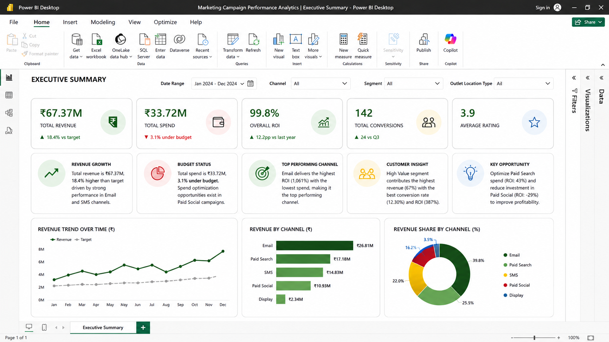
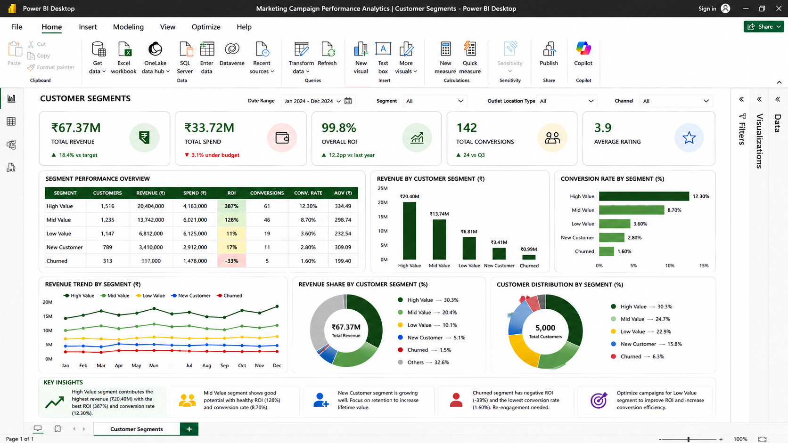
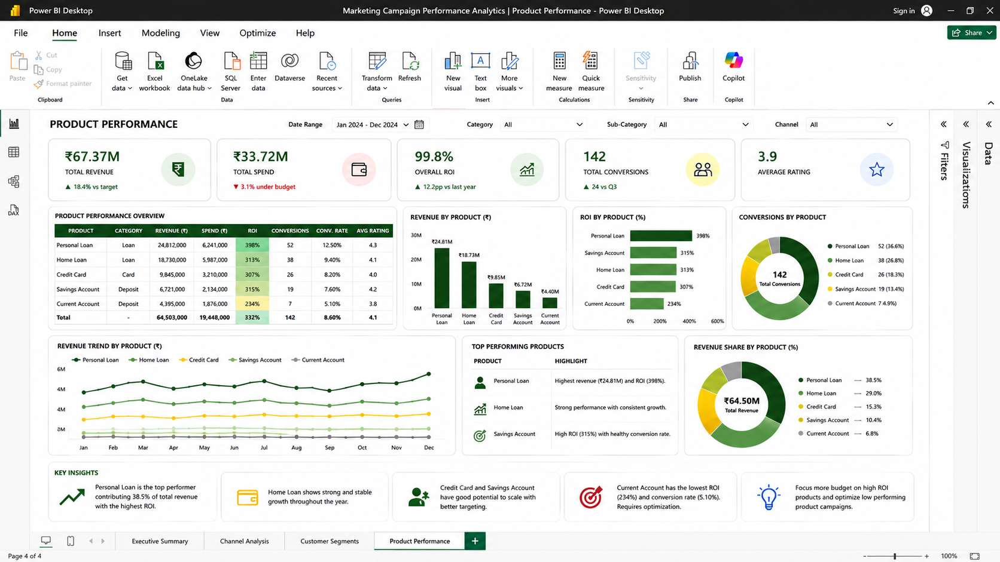

# Marketing Campaign Performance Analytics

## Project Overview
This project analyzes marketing campaign performance across multiple channels and customer segments to evaluate ROI, conversion rates, and campaign effectiveness.

## Business Problem
Marketing teams need to identify which channels and customer segments generate the highest returns in order to optimize campaign spending and improve customer engagement.

## Tools Used
- Python
- Pandas
- NumPy
- SQL (SQLite)
- Matplotlib
- Jupyter Notebook

## Key Metrics Analyzed
- ROI (Return on Investment)
- Conversion Rate
- Revenue
- Campaign Cost
- Customer Segmentation

## Key Insights
- Email campaigns generated the highest ROI.
- SMS campaigns showed strong cost efficiency.
- Paid Social campaigns produced negative ROI and require optimization.
- High-value customer segments contributed the largest revenue share.

## Files
- Marketing.ipynb
- marketing_campaign_data.csv
- channel_performance.csv
- segment_performance.csv
- campaign_charts.png

## Business Recommendations
- Increase investment in Email campaigns.
- Optimize or reduce Paid Social spending.
- Focus targeting on high-value customer segments.
- Implement continuous campaign performance monitoring.

# Dashboard Screenshots

## Executive Summary

## Channel Analysis

## Customer Segments

## Product Performance

## Author
Nayan Kumar Biradar
